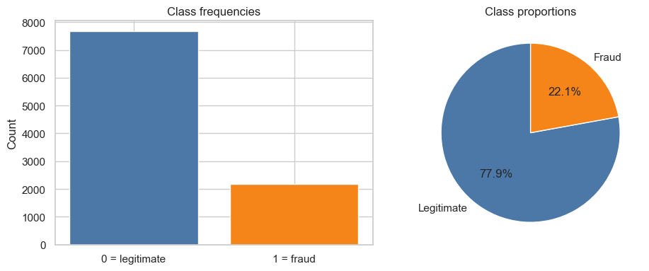
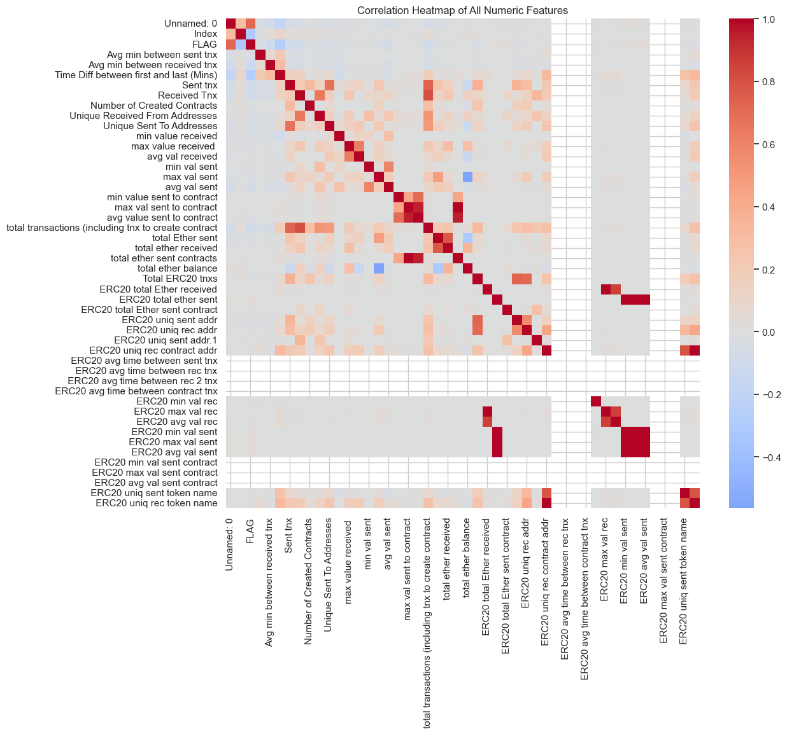
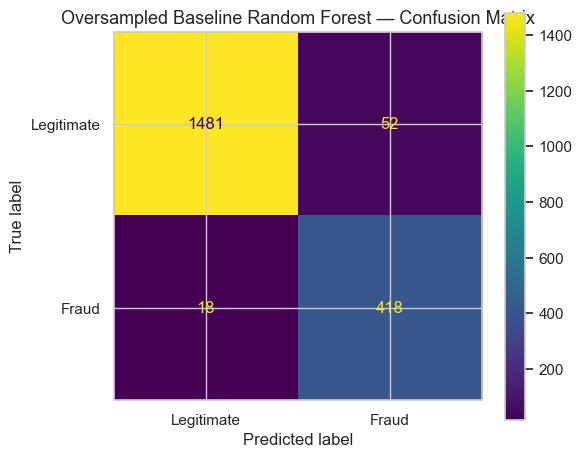
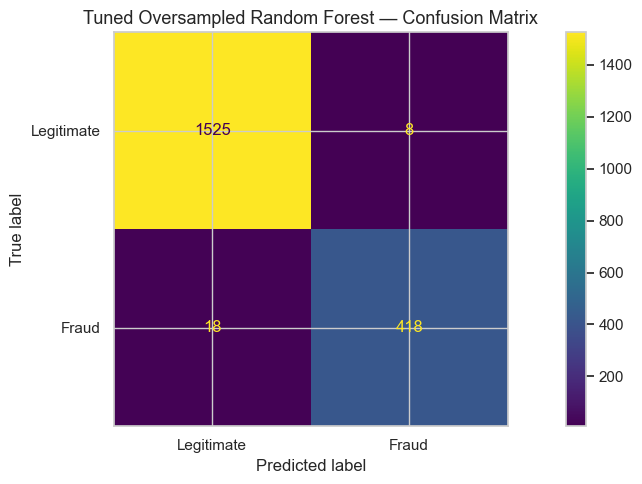
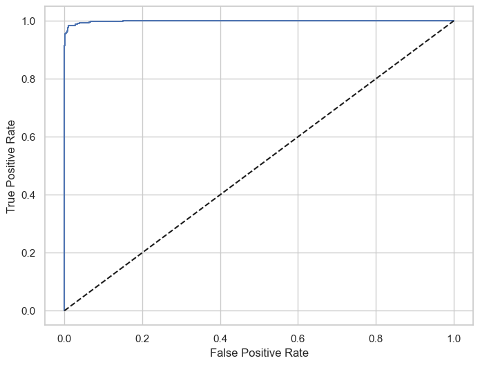
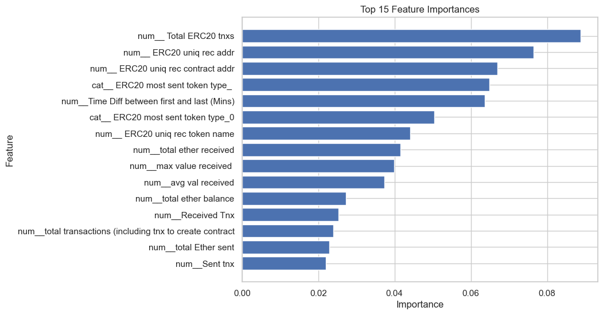
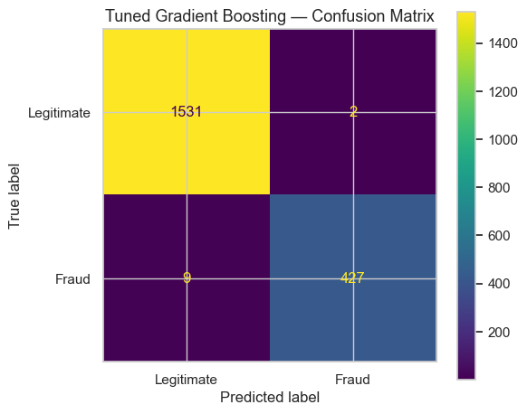
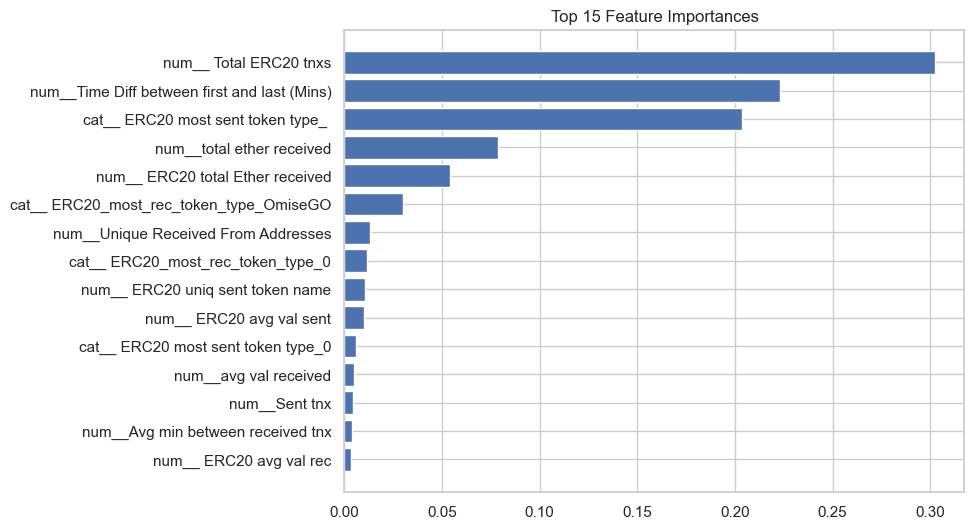

# Ethereum Fraud Detection

**Author:** Dominic Rueck · **Course project (Spring 2026)**  
**Notebook:** [`Ethereum Fraud Detection.ipynb`](Ethereum%20Fraud%20Detection.ipynb) (written for **Google Colab** and local Jupyter).  
**Data:** [`transaction_dataset.csv`](transaction_dataset.csv) (Kaggle: [Ethereum Transaction Dataset for Fraud Detection](https://www.kaggle.com/datasets/vagifa/ethereum-frauddetection-dataset)).

---

## Project workflow

The notebook follows an end-to-end analytics workflow:

1. **Problem framing and data acquisition**
2. **Exploratory data analysis (EDA) and data preparation**
3. **Model development, evaluation, and interpretation**

---

## Problem and target

The goal is a **binary classifier** at the **wallet (address) level**: predict whether an Ethereum address is associated with fraudulent behavior using aggregated transaction statistics. The supervised label is **`FLAG`** (0 = legitimate, 1 = fraud).

---

## Dataset summary

- **Size:** 9,841 rows × 51 columns in the raw CSV (per `df.info()` in the notebook).
- **Class imbalance:** About **22%** fraud vs **78%** legitimate (roughly **3.5:1** majority to minority). The notebook reports fractions after cleaning; metrics emphasize **precision, recall, F1**, **Cohen’s kappa**, and **ROC-AUC**, not accuracy alone.
- **Missing values:** Common in **ERC-20–related** columns when a wallet has little or no token activity. The modeling pipeline uses **imputation** rather than dropping those rows.

---

## EDA and visualizations (in the notebook)

The notebook generates plots with **matplotlib** and **seaborn**, including:

- Missingness summary (bar-style figure when implemented in the notebook).
- **Class distribution** for `FLAG`.
- **Correlation heatmap** for numeric features.
- Box and violin plots for top features **by class** (before and after preprocessing steps as coded).

| Topic | Preview |
|--------|--------|
| Class balance |  |
| Feature relationships |  |

---

## Data preparation (current notebook logic)

- **Identifier columns removed:** `Unnamed: 0`, `Index`, and **`Address`** so the model does not memorize row keys or raw string IDs.
- **Numeric outliers:** Values (excluding the target) are **soft-capped** with **1.5× IQR**; when IQR is ~0, the notebook falls back to clipping at the **1st–99th percentiles** and prints how many cells were clipped.
- **Zero-variance numerics:** Columns with **≤1 unique value** are dropped after outlier treatment.
- **High-cardinality categoricals:** **`ERC20 most sent token type`** and **`ERC20_most_rec_token_type`** are dropped before modeling (very high cardinality; noted in the notebook).
- **Train / test split:** **Stratified 80/20** (`test_size=0.20`, `random_state=123`) so train and test keep a similar fraud rate.

---

## Modeling approach

Two **tree-based** classifiers are trained on the **same** preprocessing and **oversampled training data**, then evaluated on the **same** held-out test set so results are directly comparable.

- **Libraries:** **pandas**, **NumPy**, **scikit-learn** (`Pipeline`, `ColumnTransformer`, imputers, `OneHotEncoder`, **`GridSearchCV`**), **matplotlib**, **seaborn**.
- **Preprocessing pipeline:**
  - Numeric features: **median** imputation (no scaling required for tree splits in this setup).
  - Categorical features: **most frequent** imputation + **one-hot** encoding (`handle_unknown='ignore'`).
- **Class imbalance:** After the split, the **minority (fraud) class is oversampled in the training set only** using `sklearn.utils.resample`. The **test set** keeps the real class mix. Both models use `X_train_balanced` / `y_train_balanced` for fitting and `X_test` / `y_test` for evaluation.

### Model 1 — Random Forest (course baseline + tuned)

- **Baseline:** Random Forest with a **shallower** `max_depth` for a simple reference.
- **Tuned:** `GridSearchCV` (**5-fold CV**, scoring **`f1`**, fraud as positive class) over `n_estimators`, `max_depth`, `min_samples_split`, `min_samples_leaf`, and **`class_weight`** (`None` vs `'balanced'`).

### Model 2 — Gradient Boosting (comparison)

- **Algorithm:** **`GradientBoostingClassifier`**: trees are added **sequentially**; each stage fits the residual errors of the ensemble so far. That differs from Random Forest, where many trees are fit **in parallel** on bootstrap samples and their predictions are averaged or voted.
- **Tuned:** Same pipeline object and balanced training data; **`GridSearchCV`** with **`f1`** over `n_estimators`, `max_depth`, `learning_rate`, and `min_samples_leaf`.

### Evaluation

- Classification reports, **confusion matrices**, **ROC-AUC**, **Cohen’s kappa**, and **feature importances** (`feature_importances_`) for interpretation.
- The notebook prints a **single-line test comparison** (F1 on fraud, kappa, ROC-AUC) for Random Forest vs Gradient Boosting.

### Random Forest — exported figures

### Gradient Boosting — exported figures

---

## Random Forest vs Gradient Boosting (test-set comparison)

On **the same** stratified test split, **both** models achieve **strong** fraud detection; the run captured in the notebook gives:

| Model | F1 (fraud) | Cohen’s κ | ROC-AUC |
|--------|------------|-----------|---------|
| Tuned **Random Forest** | 0.9698 | 0.9614 | 0.9988 |
| Tuned **Gradient Boosting** | **0.9873** | **0.9837** | **0.9995** |

**How to read this in plain language**

- **Random Forest** is a solid, interpretable default: diverse parallel trees often **generalize well** and are **less sensitive to some hyperparameter choices**.
- **Gradient Boosting**, in this run, **edges slightly ahead** on F1 for fraud, kappa, and ROC-AUC—consistent with boosting sometimes squeezing extra signal from tabular data when tuned—at the cost of **sequential fitting** (typically slower to train than a similarly sized forest unless you switch to histogram-based implementations).
- **Feature importance** differs in **ranking and emphasis** between the two (see the bar charts above); both should be read as *model reliance*, not proof of causation.

---

## How to run

1. Place **`transaction_dataset.csv`** next to the notebook (or adjust `data_path` in the loading cell).
2. Open the notebook in **Jupyter**, **VS Code**, or **Google Colab** (upload the CSV if using Colab).
3. Run **all cells** from top to bottom so derived `df`, `X_train_balanced`, tuned models, and comparison prints stay consistent.

---

## Repository layout (main artifacts)

| File | Role |
|------|------|
| [`Ethereum Fraud Detection.ipynb`](Ethereum%20Fraud%20Detection.ipynb) | Full analysis, tuning, and comparison |
| `transaction_dataset.csv` | Kaggle dataset (not always committed; obtain from Kaggle if missing) |
| `images/` | Exported figures (RF, GBM, EDA, ROC) |
| `ethereum_fraud_rf_model.pkl` | Saved tuned Random Forest pipeline (after running the save cell) |
| `ethereum_fraud_gbm_model.pkl` | Saved tuned Gradient Boosting pipeline (after running the save cell) |
